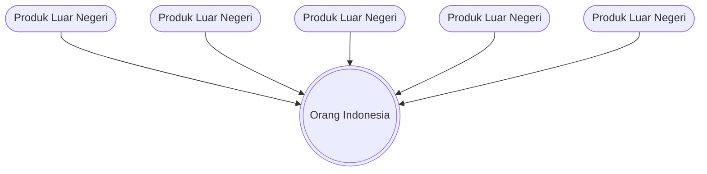
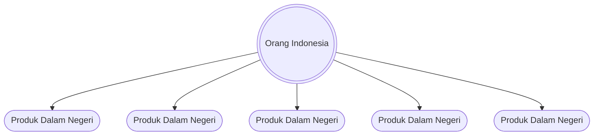

## ADDED Requirements

### Requirement: Mermaid Diagram Rendering

The system SHALL render Mermaid diagrams in MDX content with theme-aware styling.

#### Scenario: Render mermaid diagram from component syntax

- **WHEN** an MDX file contains `<Mermaid chart="graph TD; A-->B;" />`
- **THEN** the diagram is rendered as an SVG in the page
- **AND** the diagram uses the current theme's colors (light or dark)

#### Scenario: Render mermaid diagram from code block syntax

- **WHEN** an MDX file contains a fenced code block with language `mermaid`
- **THEN** the `remarkMdxMermaid` plugin transforms it to a `<Mermaid>` component
- **AND** the diagram is rendered as an SVG in the page

#### Scenario: Theme-aware diagram styling

- **WHEN** the user switches between light and dark themes
- **THEN** the Mermaid diagram re-renders with the appropriate theme colors
- **AND** dark theme uses Mermaid's `dark` theme
- **AND** light theme uses Mermaid's `default` theme

#### Scenario: SSR-safe rendering

- **WHEN** the page is server-rendered
- **THEN** the Mermaid component renders nothing until client-side mount
- **AND** no hydration mismatch errors occur

### Requirement: Mermaid MDX Plugin Configuration

The system SHALL configure the `remarkMdxMermaid` plugin to transform mermaid code blocks.

#### Scenario: Code block transformation

- **WHEN** `source.config.ts` is loaded
- **THEN** `remarkMdxMermaid` from `fumadocs-core/mdx-plugins` is included in remark plugins
- **AND** markdown code blocks with `mermaid` language are transformed to `<Mermaid>` components

### Requirement: Mermaid Component Registration

The system SHALL register the Mermaid component for use in MDX content.

#### Scenario: Docs route component registration

- **WHEN** MDX content is rendered in the docs route (`/$lang/docs/$`)
- **THEN** the `Mermaid` component is available in the MDX component mapping

#### Scenario: Dev route component registration

- **WHEN** MDX content is rendered in the dev route (`/$lang/dev/$`)
- **THEN** the `Mermaid` component is available in the MDX component mapping

### Requirement: BlankOn Transformation Diagrams Migration

The system SHALL replace static PNG diagrams in the "Tentang BlankOn" page with Mermaid code block diagrams.

#### Scenario: Foreign products diagram (produk-luar-negeri)

- **WHEN** the "Tentang BlankOn" page is rendered
- **THEN** the consumer mentality diagram is rendered using a Mermaid code block:

- **AND** the static image `produk-luar-negeri.png` is no longer used

#### Scenario: Domestic products diagram (produk-sendiri)

- **WHEN** the "Tentang BlankOn" page is rendered
- **THEN** the producer mentality diagram is rendered using a Mermaid code block:

- **AND** the static image `produk-sendiri.png` is no longer used
