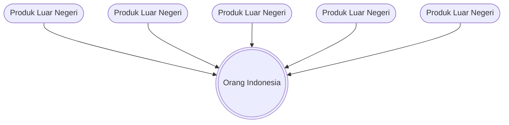
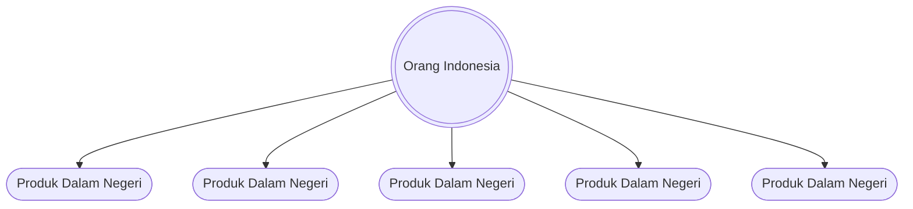

# docs-content Specification

## Purpose
TBD - created by archiving change document-existing-codebase. Update Purpose after archive.
## Requirements
### Requirement: Content Collections

The system SHALL define MDX content collections using Fumadocs `defineDocs` in `source.config.ts`.

#### Scenario: Docs collection definition

- **WHEN** the docs collection is configured
- **THEN** it reads from `content/docs/` directory

#### Scenario: Dev collection definition

- **WHEN** the dev collection is configured
- **THEN** it reads from `content/dev/` directory

### Requirement: Content Source Loaders

Each content collection SHALL have a loader with i18n support and a base URL.

#### Scenario: Docs source loader

- **WHEN** the docs source is initialized
- **THEN** it uses the shared i18n configuration
- **AND** has baseUrl of `/docs`

#### Scenario: Dev source loader

- **WHEN** the dev source is initialized
- **THEN** it uses the shared i18n configuration
- **AND** has baseUrl of `/dev`

### Requirement: Page Retrieval

The system SHALL provide methods to retrieve pages by slug array and language.

#### Scenario: Get page by slugs

- **WHEN** `source.getPage(['getting-started'], 'en')` is called
- **THEN** the English "getting-started" page is returned
- **OR** `undefined` if the page does not exist

#### Scenario: Get all pages for language

- **WHEN** `source.getPages('id')` is called
- **THEN** all Indonesian documentation pages are returned

### Requirement: Page Tree Navigation

The system SHALL generate a page tree for sidebar navigation based on content structure.

#### Scenario: Page tree generation

- **WHEN** `source.getPageTree('en')` is called
- **THEN** a hierarchical tree of all English pages is returned
- **AND** the tree can be serialized for client-side use

### Requirement: MDX Frontmatter

Each MDX file SHALL have frontmatter with at least `title` and `description` fields.

#### Scenario: Required frontmatter fields

- **WHEN** an MDX file has frontmatter
- **THEN** `title` field is present and non-empty
- **AND** `description` field is present

### Requirement: Client-Side Content Loading

MDX content SHALL be loaded on the client using `createClientLoader` with preloading support.

#### Scenario: Content preloading

- **WHEN** a documentation route is loaded
- **THEN** `clientLoader.preload(path)` is called during route loading
- **AND** `clientLoader.getComponent(path)` returns the content component

### Requirement: DocsPage Structure

Documentation pages SHALL render using Fumadocs UI components in a consistent structure.

#### Scenario: Page component structure

- **WHEN** an MDX page is rendered
- **THEN** it uses `DocsPage` wrapper with table of contents
- **AND** `DocsTitle` displays the frontmatter title
- **AND** `DocsDescription` displays the frontmatter description
- **AND** `DocsBody` wraps the MDX content

### Requirement: Default MDX Components

MDX content SHALL use default Fumadocs components for code blocks, links, and other elements.

#### Scenario: MDX component mapping

- **WHEN** MDX content is rendered
- **THEN** `defaultMdxComponents` are provided to the MDX component
- **AND** code blocks have syntax highlighting

### Requirement: Table of Contents

Documentation pages SHALL display a table of contents generated from MDX headings.

#### Scenario: TOC generation

- **WHEN** an MDX page with headings is rendered
- **THEN** the `toc` prop contains heading IDs, text, and depth
- **AND** `DocsPage` renders the TOC in a sidebar

### Requirement: 404 Handling

The system SHALL return a 404 error when a requested page does not exist.

#### Scenario: Page not found

- **WHEN** `source.getPage(['nonexistent'], 'en')` returns undefined
- **THEN** the server function throws `notFound()`
- **AND** a 404 page is displayed to the user

### Requirement: Documentation Content Migration Script

The system SHALL provide a migration script to fetch and transform documentation content and images from the panduan-distribusi GitHub repository into MDX format compatible with Fumadocs.

#### Scenario: Fetch chapter content from GitHub

- **WHEN** the migration script is executed
- **THEN** it SHALL fetch all 15 chapter Markdown files from `https://raw.githubusercontent.com/BlankOn/panduan-distribusi/master/contents/`

#### Scenario: Fetch images from GitHub

- **WHEN** the migration script is executed
- **THEN** it SHALL recursively fetch all image files from `contents/Gambar/` and `contents/CuplikanLayar/` directories
- **AND** it SHALL download images to `public/docs/` preserving the directory structure

#### Scenario: Transform Markdown to MDX

- **GIVEN** the source files are Markdown (`.md`) with embedded LaTeX commands (designed for Pandoc PDF generation)
- **WHEN** a Markdown file is fetched successfully
- **THEN** the script SHALL apply these transformations:
  - Remove LaTeX commands (`\newpage`)
  - Convert HTML entities to characters (`=&gt;` to `=>`, `&amp;` to `&`, `&lt;` to `<`, `&gt;` to `>`)
  - Remove anchor span tags (``)
  - Convert or remove HTML comments (`<!-- -->` removed, others to `{/* */}`)
  - Remove backslash escapes (`\_`, `\~`, `\$`, `\#`, `\*`)
  - Convert autolink URLs (`<http://...>` to `[url](url)`)
  - Convert autolink emails (`<email@domain>` to `[email](mailto:email)`)
  - Escape JSX-like placeholder tags (`<name>` to `` `<name>` ``)
  - Escape asterisk patterns (`<***>` to `` `<***>` ``)
  - Convert code block language `terminal` to `bash`
  - Transform image paths from relative to absolute (`/docs/...`)
  - Extract title from first H1 heading for frontmatter
  - Remove the first H1 heading (moved to frontmatter)
  - Normalize multiple blank lines to double newlines

#### Scenario: Create directory structure

- **WHEN** content transformation is complete
- **THEN** the script SHALL create a directory under `content/docs/` using the slug derived from the source filename (e.g., `BAB-002-Pengenalan.md` becomes `pengenalan/`)

#### Scenario: Write MDX files

- **WHEN** a chapter directory is created
- **THEN** the script SHALL write the transformed content to `index.mdx` within that directory

#### Scenario: Generate navigation metadata

- **WHEN** all chapters are processed
- **THEN** the script SHALL generate a `meta.json` file in `content/docs/` using Fumadocs object format: `{ "pages": [...] }`

### Requirement: Documentation Content Structure

The documentation content SHALL follow the Fumadocs MDX content structure conventions.

#### Scenario: MDX frontmatter format

- **WHEN** an MDX file is created
- **THEN** it SHALL contain YAML frontmatter with at least a `title` field

#### Scenario: Chapter organization

- **WHEN** documentation is migrated
- **THEN** each chapter SHALL reside in its own directory under `content/docs/` with an `index.mdx` file

#### Scenario: Navigation ordering with category separators

- **WHEN** `meta.json` is generated
- **THEN** it SHALL list chapters grouped by category using Fumadocs separator syntax (`---Label---`)
- **AND** it SHALL include `index` as the first entry
- **AND** chapters SHALL be organized into 5 categories matching the Daftar Isi structure:
  - **Pengenalan**: ihwalbuku, pengenalan
  - **Memulai**: pemasangan, destop, peramban-berkas
  - **Aplikasi**: aplikasi-internet, aplikasi-perkantoran, aplikasi-grafis, aplikasi-multimedia-hiburan, aplikasi-aksesoris
  - **Pengaturan Lanjutan**: manajemen-paket, pengaturan-antarmuka-teks, pengaturan-piranti-keras, manajemen-pengguna-dan-kelompok
  - **Penutup**: penutup

### Requirement: Image Asset Migration

The system SHALL migrate all documentation images to the public directory.

#### Scenario: Image directory structure

- **WHEN** images are migrated
- **THEN** they SHALL be placed in `public/docs/` preserving the source directory structure
- **AND** images from `contents/Gambar/` SHALL be in `public/docs/Gambar/`
- **AND** images from `contents/CuplikanLayar/` SHALL be in `public/docs/CuplikanLayar/`

#### Scenario: Image path transformation

- **WHEN** MDX content references images
- **THEN** relative paths like `./CuplikanLayar/file.png` or `Gambar/file.png` SHALL be transformed to `/docs/CuplikanLayar/file.png` or `/docs/Gambar/file.png`

#### Scenario: Supported image formats

- **WHEN** fetching images from GitHub
- **THEN** the script SHALL download files with extensions: `png`, `jpg`, `jpeg`, `gif`, `svg`, `ico`, `webp`

### Requirement: Mermaid Diagram Rendering

The system SHALL render Mermaid diagrams in MDX content with theme-aware styling.

#### Scenario: Render mermaid diagram from component syntax

- **WHEN** an MDX file contains `<Mermaid chart="graph TD; A-->B;" />`
- **THEN** the diagram is rendered as an SVG in the page
- **AND** the diagram uses the current theme's colors (light or dark)

#### Scenario: Render mermaid diagram from code block syntax

- **WHEN** an MDX file contains a fenced code block with language `mermaid`
- **THEN** the `remarkMdxMermaid` plugin transforms it to a `<Mermaid>` component
- **AND** the diagram is rendered as an SVG in the page

#### Scenario: Theme-aware diagram styling

- **WHEN** the user switches between light and dark themes
- **THEN** the Mermaid diagram re-renders with the appropriate theme colors
- **AND** dark theme uses Mermaid's `dark` theme
- **AND** light theme uses Mermaid's `default` theme

#### Scenario: SSR-safe rendering

- **WHEN** the page is server-rendered
- **THEN** the Mermaid component renders nothing until client-side mount
- **AND** no hydration mismatch errors occur

### Requirement: Mermaid MDX Plugin Configuration

The system SHALL configure the `remarkMdxMermaid` plugin to transform mermaid code blocks.

#### Scenario: Code block transformation

- **WHEN** `source.config.ts` is loaded
- **THEN** `remarkMdxMermaid` from `fumadocs-core/mdx-plugins` is included in remark plugins
- **AND** markdown code blocks with `mermaid` language are transformed to `<Mermaid>` components

### Requirement: Mermaid Component Registration

The system SHALL register the Mermaid component for use in MDX content.

#### Scenario: Docs route component registration

- **WHEN** MDX content is rendered in the docs route (`/$lang/docs/$`)
- **THEN** the `Mermaid` component is available in the MDX component mapping

#### Scenario: Dev route component registration

- **WHEN** MDX content is rendered in the dev route (`/$lang/dev/$`)
- **THEN** the `Mermaid` component is available in the MDX component mapping

### Requirement: BlankOn Transformation Diagrams Migration

The system SHALL replace static PNG diagrams in the "Tentang BlankOn" page with Mermaid code block diagrams.

#### Scenario: Foreign products diagram (produk-luar-negeri)

- **WHEN** the "Tentang BlankOn" page is rendered
- **THEN** the consumer mentality diagram is rendered using a Mermaid code block:

- **AND** the static image `produk-luar-negeri.png` is no longer used

#### Scenario: Domestic products diagram (produk-sendiri)

- **WHEN** the "Tentang BlankOn" page is rendered
- **THEN** the producer mentality diagram is rendered using a Mermaid code block:

- **AND** the static image `produk-sendiri.png` is no longer used

